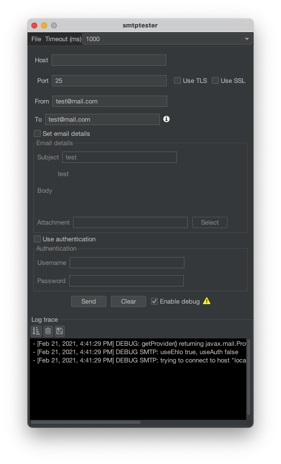

# smtptester
Simple java app to test smtp server connection.

### Why use smtptester
1. Can run with GUI and CLI both
2. Better than google's [woodpecker-tester](https://code.google.com/archive/p/woodpecker-tester/){: target="_blank"}
3. Can work with or without Authentication

### Requirements

* JRE 11+

### Run

Just double click on the .jar file or run the following command.

`java -jar smtptester-1.1.0.jar`

### CLI

You can also use this tool from the command line the same way as run the GUI but adding some additional parameters.

Run the following command to get a list of parameters.

`java -jar smtptester-1.1.0.jar -h`

### Quick Run on Linux
wget https://github.com/aaroca/smtptester/releases/download/1.1.0/smtptester-1.1.0.jar
java -jar smtptester-1.1.0.jar -d -s smtp.domain.com -t user@domain.com
